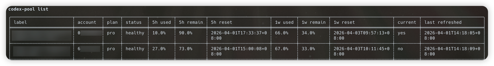

# codex-pool

[English](./README.md) | [简体中文](./README.zh-CN.md)

Thanks to [codex-tools](https://github.com/170-carry/codex-tools) for the proven multi-account management approach. The core account parsing, usage fetching, and switching flow in `codex-pool` is adapted and trimmed from that project.

`codex-pool` is a multi-account pool manager for Codex CLI. It is designed to help with:

- Managing multiple Codex accounts
- Viewing 5h / 1week usage for each account
- Switching to the best available account with one command
- Launching `codex` immediately after switching
- Re-authorizing expired accounts
- Exposing a local OpenAI / Anthropic compatible proxy API with multi-account balancing

Compared with the desktop `codex-tools`, `codex-pool` is:

- CLI-first, with no GUI, tray, or cloudflared features
- Using its own account store at `~/.codex-pool/accounts.json`
- Able to import accounts from the legacy `codex-tools` repository in one shot
- Still relying on `~/.codex/auth.json` as the live auth that actually takes effect
- Able to run a local compatibility proxy without mutating the live auth file per request

Example output from `codex-pool --list`:



## Installation

After a release is published, install it with:

```bash
curl -fsSL https://github.com/lilong7676/codex-pool/releases/latest/download/install.sh | sh
```

By default, it installs to `~/.local/bin`. Override it with environment variables if needed:

```bash
INSTALL_DIR="$HOME/bin" VERSION="v0.1.4" curl -fsSL https://github.com/lilong7676/codex-pool/releases/latest/download/install.sh | sh
```

Prerequisites:

- The official `codex` CLI is already installed
- `codex login` can complete authorization successfully in your browser
- The first release supports macOS and Linux

## Agent Skill

You can also install `codex-pool` as a Codex skill:

```bash
npx skills add lilong7676/codex-pool --skill codex-pool
```

The skill lives in `skills/codex-pool/` in this repository. On first use it checks whether `codex-pool` is already available and whether its version matches the skill's pinned `v0.1.4` release. If it is missing or older, the skill explains that it will download the pinned archive plus its SHA256 file from this repository's GitHub Releases, verify the checksum, and install or upgrade the binary in `~/.local/bin` (or `INSTALL_DIR`). It only proceeds after explicit user confirmation.

Skill prerequisites stay the same:

- The official `codex` CLI is already installed
- `codex login` can complete authorization successfully in your browser

The skill is distributed from this public GitHub repository. After users install it with `npx skills add`, `skills.sh` can pick it up from anonymous installation telemetry; there is no separate manual publish flow.

## First-Time Setup

Run this after installation:

```bash
codex-pool init
```

## Updating

Update the installed `codex-pool` binary in place:

```bash
codex-pool update
```

Pin a specific release tag:

```bash
codex-pool update --version v0.1.4
```

If you prefer the published shell installer, rerun:

```bash
curl -fsSL https://github.com/lilong7676/codex-pool/releases/latest/download/install.sh | sh
```

To refresh the skill files themselves, rerun:

```bash
npx skills add lilong7676/codex-pool --skill codex-pool
```

After the skill updates, the next skill invocation will compare the installed `codex-pool` version with the skill's pinned version and offer an upgrade when they differ.

`init` performs the following steps:

1. Check whether the `codex` CLI is available
2. Check whether the current `~/.codex/auth.json` exists and ask whether to import it
3. Detect a legacy `codex-tools` repository and ask whether to migrate it
4. Walk you through adding one or more accounts
5. Print a short summary of common commands at the end

Account adding does not implement OAuth independently. Instead, it reuses the official `codex login` flow:

- Back up the current `~/.codex/auth.json`
- Run `codex login`
- Wait for the new auth file to appear
- Import the new account into `codex-pool`
- Restore the previous live auth at the end

This means adding an account will not permanently replace the account you are currently using.

## Common Commands

List accounts:

```bash
codex-pool list
codex-pool list --refresh
codex-pool list --refresh --json
```

Watch usage:

```bash
codex-pool watch
codex-pool watch --interval 30
```

Add / remove accounts:

```bash
codex-pool add
codex-pool add --label "Work Pro"
codex-pool rm <account-ref>
```

Switch accounts:

```bash
codex-pool use <account-ref>
codex-pool use --best
```

Switch and launch `codex` immediately:

```bash
codex-pool run --best
codex-pool run --best -- exec "fix the failing tests"
codex-pool run <account-ref> -- app
```

Refresh usage:

```bash
codex-pool refresh
codex-pool refresh <account-ref>
```

Re-authorize an account:

```bash
codex-pool reauth <account-ref>
```

Run health checks:

```bash
codex-pool doctor
codex-pool update --yes
```

Run the local proxy:

```bash
codex-pool serve
codex-pool serve --daemon
codex-pool serve-status
codex-pool serve-stop
codex-pool serve-restart --daemon
codex-pool serve-logs
codex-pool serve-logs --follow
codex-pool serve --listen 127.0.0.1:4141 --api-key codex-pool-local
codex-pool serve --default-model gpt-5.4 --cwd /path/to/worktree
```

## Local Proxy

`codex-pool serve` starts a local HTTP proxy that load-balances requests across stored accounts without rewriting your real `~/.codex/auth.json`. Each account maintains a small pool of persistent `codex app-server` workers, and each request still runs in an isolated account-specific `HOME`.

Supported endpoints:

- `POST /v1/chat/completions`
- `GET /v1/models`
- `POST /v1/messages`
- `GET /healthz`
- `GET /admin/accounts`

Authentication headers:

- OpenAI-compatible routes: `Authorization: Bearer <api_key>`
- Anthropic-compatible routes: `x-api-key: <api_key>`
- Anthropic-compatible routes also require `anthropic-version: 2023-06-01`

Streaming:

- OpenAI-compatible streaming returns `chat.completion.chunk` SSE plus `data: [DONE]`
- Anthropic-compatible streaming returns named SSE events such as `message_start`, `content_block_delta`, and `message_stop`

Background mode:

- `codex-pool serve --daemon` starts the proxy in the background
- `codex-pool serve-status` shows whether the background proxy is running
- `codex-pool serve-stop` stops the background proxy
- `codex-pool serve-restart --daemon` restarts the background proxy with updated options
- `codex-pool serve-logs` prints recent proxy logs
- `codex-pool serve-logs --follow` tails the proxy log
- The PID is stored at `~/.codex-pool/proxy.pid`
- Logs are appended to `~/.codex-pool/proxy.log`

Current compatibility limits:

- OpenAI: `model`, `messages`, `stream`
- Anthropic: `model`, `system`, `messages`, `max_tokens`, `stream`
- Text-only inputs; no tools, no images, no documents, no thinking blocks, no session stickiness

Example OpenAI-compatible request:

```bash
curl http://127.0.0.1:4141/v1/chat/completions \
  -H 'Authorization: Bearer codex-pool-local' \
  -H 'Content-Type: application/json' \
  -d '{
    "model": "codex",
    "messages": [{"role": "user", "content": "Say hi in one sentence."}]
  }'
```

Example Anthropic-compatible request:

```bash
curl http://127.0.0.1:4141/v1/messages \
  -H 'x-api-key: codex-pool-local' \
  -H 'anthropic-version: 2023-06-01' \
  -H 'Content-Type: application/json' \
  -d '{
    "model": "codex",
    "max_tokens": 256,
    "messages": [{"role": "user", "content": "Say hi in one sentence."}]
  }'
```

Proxy config lives in `~/.codex-pool/config.toml` under `[proxy]`:

```toml
[proxy]
listen = "127.0.0.1:4141"
api_key = "codex-pool-local"
default_cwd = "/absolute/path/to/worktree"
default_model = "gpt-5.4"
sandbox = "workspace-write"
approval_policy = "never"
usage_refresh_interval_seconds = 60
max_concurrent_requests = 8
max_inflight_per_account = 1

[proxy.model_aliases]
codex = "gpt-5.4"
```

## Account Reference Rules

`<account-ref>` supports three forms with fixed priority:

1. Exact match on the internal `id`
2. Exact match on `account_id`
3. Unique prefix match on `id` or `account_id`

If a prefix matches multiple accounts, the command fails and prints the candidates.

## Best-Account Selection Rules

`--best` uses this fixed ranking order:

1. Compare remaining `1week` ratio first
2. Then compare remaining `5h` ratio
3. Prefer the current live account next
4. Finally use `label` as a stable tie-breaker

These states are excluded from `--best`:

- `expired`
- `workspace_removed`

## Re-Authorization

When an account's refresh token becomes invalid, `list --refresh` often shows:

- `expired`
- `reauth_required`

Then run:

```bash
codex-pool reauth <account-ref>
```

`reauth` runs the `codex login` flow again, but with one strict validation:

- The newly logged-in `account_id` must match the target account
- If your browser signs in to a different account, the operation fails and restores the previous live auth

## Migrate from codex-tools

If you previously used the desktop `codex-tools`, you can migrate its account store:

```bash
codex-pool import codex-tools
```

You can also provide the legacy repository path explicitly:

```bash
codex-pool import codex-tools --path /path/to/accounts.json
```

Default lookup paths:

- macOS: `~/Library/Application Support/com.carry.codex-tools/accounts.json`
- Linux: `~/.local/share/com.carry.codex-tools/accounts.json`

## Data Files

- `~/.codex-pool/accounts.json`: account store used by `codex-pool`
- `~/.codex-pool/config.toml`: `codex-pool` configuration
- `~/.codex/auth.json`: current live Codex auth; account switching writes this file directly

## Development

```bash
cargo test
cargo run -- --help
```

The release workflow builds these artifacts:

- `codex-pool-aarch64-apple-darwin.tar.gz`
- `codex-pool-aarch64-apple-darwin.tar.gz.sha256`
- `codex-pool-x86_64-apple-darwin.tar.gz`
- `codex-pool-x86_64-apple-darwin.tar.gz.sha256`
- `codex-pool-x86_64-unknown-linux-gnu.tar.gz`
- `codex-pool-x86_64-unknown-linux-gnu.tar.gz.sha256`
- `install.sh`
